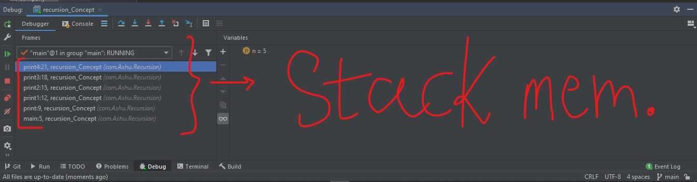
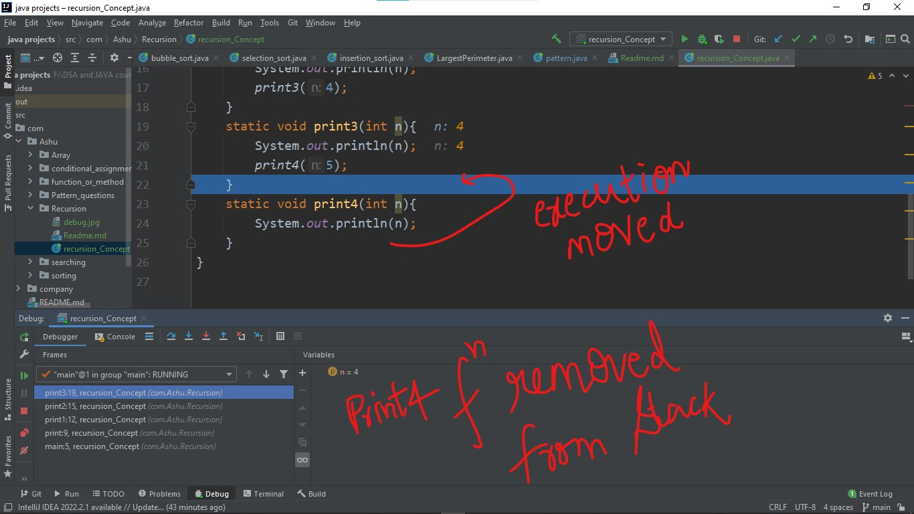

#Recursion Concepts (java)

Reference: [Recursion playlist Kunal Kushwaha](https://youtube.com/playlist?list=PL9gnSGHSqcnp39cTyB1dTZ2pJ04Xmdrod)

This Readme file contains all the concept related to the **Recursion**.
### Before moving to the Recursion, let us just understand how functions work internally.

When you call any function, it comes inside the stack memory until its work is done.

let us understand it with an example of a program that print numbers from 1 to 5.
```java
public class recursion_Concept {
    public static void main(String[] args) {
        print(1);
    }
    static void print(int n){
        System.out.println(n);
        print1(2);
    }static void print1(int n){
        System.out.println(n);
        print2(3);
    }static void print2(int n){
        System.out.println(n);
        print3(4);
    }static void print3(int n){
        System.out.println(n);
        print4(5);
    }static void print4(int n){
        System.out.println(n);
    }
}
```
Basically what is happening here is that in the very first, the `main` function is called and in the `main` function the `print` function is called, in `print` function the `print1` function is called and so on till `print4` function, so the main function is not over yet.
so,
* The main function and all other print functions will remain in the stack memory until their work is done.


When we try to debug it, we can see that all the functions are present in the stack memory while they are being called.



* Now, when the function finished executing it is removed from the stack memory and the flow of program is restored where it was called.
That means at last the function `print4` is called and when it finished the flow of program (the blue line in the codebase) restored where this function is called i.e in the `print3` function you can see in the following screenshot.



* Like function `print4`, all the other print functions will also be removed from the stack when their execution will be done.

### Now let us just talk about Recursion.
In simple words Recursion is a function that calls itself.
for eg:-
```java
RecFun(){
    System.out.println("Hello World!");
    RecFun();   // Here this function is calling itself.
}
```

#### Why Recursion?
 * It helps us in solving bigger/complex problems in a simple manner.
 * You can convert recursion solutions into iteration & vice versa (First solve the complex problem using recursion then convert it into iteration to get a more optimized answer )
 * Space complexity is not constant because of recursive calls.

What things we need to keep in mind while using recursion? That is the **Base condition**.

**But what actually base condition is? in recursion.**
The condition where our recurtion will stop making new calls is called base condition.
If you are not giving any base condition to the recursive funtion you will get the error. That is why base conditions are important.


You are getting this error because,
* That if you call a function again and again, it is treated as a separate call in the stack irrespective of that the function that is being called is same or different.
* As many as you call any function, it will take memory separately.
* No base condition will cause filling of stack memory.
* Memory of the computer will exceed the limit that is called - **Stack overflow error**

Now to understand recursion let us understand it by an example:- Fibonacci series

#### nth number of Fibonacci series
**Fibonacci series** - the Fibonacci sequence, in which each number is the sum of the two preceding ones. The sequence commonly starts from 0 and 1.
0, 1, 1, 2, 3, 5, 8, 13, 21, 34, 55, 89, 144, ...

To find nth number of fibonacci series
let say if you want to print 9th fibonacci number, here are some few step to solve problem
* Break the given problem down to smaller problem.
* Create formula of the given recursion problem
* Like in case of fibonacci series:- `fib(n) = fib(n-1) + fib(n-2)`
* When you write the recursion formula, it is called recurrence relation.
* The base condition is represented by the answer we already have.
* In the fibonacci eg. the base condition is `fib(0)` = 0 and `fib(1)` = 1.
* Draw the recursive tree
* Identify the left tree calls and right tree calls.
* See the flow of function, how they are getting in stack.
* use the debugger to see how it's working.


* See how and what types of values (int, string, etc.) are returned at each step and see where the function call will come out.
* 
```java
public class fibonacci_series {
    public static void main(String[] args) {
        System.out.println("Enter the nth number you want to return");
        Scanner in = new Scanner(System.in);
        int n = in.nextInt();
        int p = fib(n);
        System.out.println(p);
    }
    static int fib(int n){
        if(n < 2){
            return n;
        }
        else{
            return fib(n-1) + fib(n-2);
        }
    }
}
```
