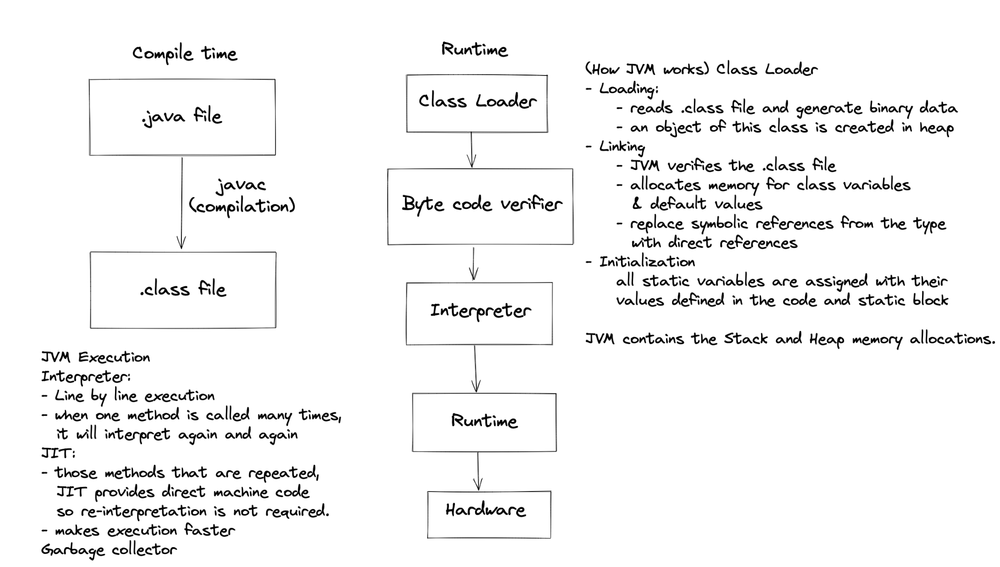

### How Java code executes

   .java file(human readable/ source code) compiled into-----> .class file(byte code) intepreted into -------> machine code(0s and 1s)

   #### - Byte code does not directly run on system, we need JVM to run this. Hence Java becomes platform independent language.

   ### How it is platform indepenent?
    - Byte code runs on all operating systems
    - We need to convert source code to machine code so that computer can understand

## Hierarchy
 ### Java development kit (JDK) = Java Runtime Environment(JRE) +  Developer tools
    - It is a package that has developer tools which provides 
        1. environment to develop the program
        2. JRE - which executes a program
        3. Compiler - javac
        4. Archiver - jar
        5. Docs generator - javadoc
        6. Interpreter/loader
        
 ### Java Runtime Environment(JRE) = Java Virtual Machine(JVM) + Library classes
    - It is a package that provides environment to run the program.
    - It consists of 
        1. deployment technologies
        2. User interface toolkits
        3. Integration libraries
        4. Base libraries
        5. JVM
    - After class file is generated, the following happens at runtime
        1. Class loader loads all class files needed to execute the program
        2. JVM sends code to bytecode verifier to check the format of the code
    
        
 ### Java Virtual Machine(JVM)

 
   